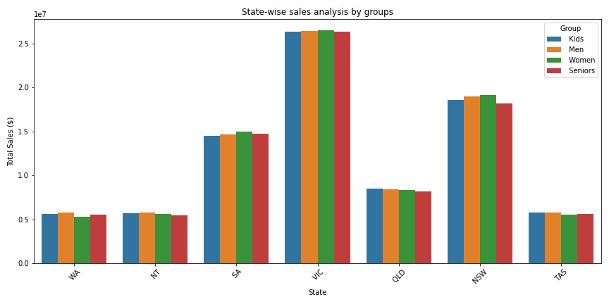
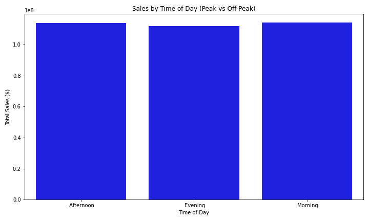
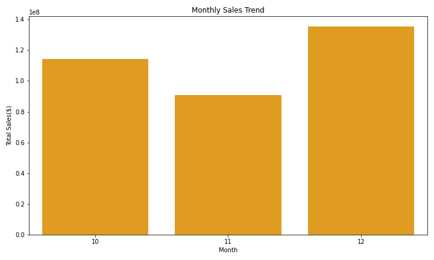

# Q4 Sales Performance Analysis

## Problem

Understanding what drives revenue growth is critical for optimizing business strategy.  
This project analyzes Q4 sales performance to identify trends, high-performing segments, and areas of opportunity.

## Objective

* Analyze sales performance across time, geography, and customer segments  
* Identify key drivers of revenue growth  
* Highlight underperforming areas  
* Provide data-driven recommendations to improve sales strategy  

## Dataset

* Sales dataset containing transaction-level data  
* Includes features such as order date, region, product/category, and sales revenue  

## Tools & Technologies

* Python (Pandas, NumPy)  
* SQL  
* Matplotlib / Seaborn  
* Jupyter Notebook  

---

## Approach

### Data Preparation

* Cleaned and structured semi-structured data into a usable format  
* Handled missing values and ensured data consistency  
* Created new features for time-based and categorical analysis  

### Exploratory Analysis

* Analyzed revenue trends over time (monthly/weekly patterns)  
* Compared performance across regions and product categories  
* Evaluated customer and product-level contributions to total revenue  

---

## Visualizations

### State-wise Sales Analysis

Different states show clear variation in total sales, highlighting geographic areas of strong and weak performance.

---

### Sales by Time of Day

Sales activity varies by time of day, with identifiable peak periods that present opportunities for targeted promotions.

---

### Monthly Sales Trend

Sales trends fluctuate across the quarter, revealing key periods of high and low performance.

---

## Key Findings

* **Revenue concentration**: A small number of products/categories drive a large portion of total sales  
* **Regional variation**: Certain regions consistently outperform others, indicating geographic opportunities  
* **Time-based trends**: Sales fluctuate across the quarter, highlighting peak periods for revenue generation  
* **Underperforming segments**: Some products/regions contribute minimally and may require strategic adjustment  

---

## Recommendations

### 1. Focus on High-Performing Products

* Increase marketing and inventory allocation toward top-performing categories  
* Double down on products with strong revenue contribution  

### 2. Optimize Underperforming Areas

* Reevaluate low-performing products or regions  
* Consider repositioning, pricing adjustments, or discontinuation  

### 3. Leverage Peak Sales Periods

* Align promotions and campaigns with high-performing time periods  
* Maximize revenue during peak demand windows  

### 4. Improve Regional Strategy

* Replicate strategies from high-performing regions  
* Investigate barriers in underperforming regions (pricing, demand, distribution)  

---

## Business Impact

* Enables more efficient allocation of resources (marketing, inventory, sales efforts)  
* Supports data-driven decision-making for revenue optimization  
* Identifies clear opportunities for growth and cost reduction  

---

## Key Takeaway

This analysis demonstrates how sales data can be leveraged to uncover revenue drivers and guide strategic decisions, helping businesses move from reactive reporting to proactive growth planning.
